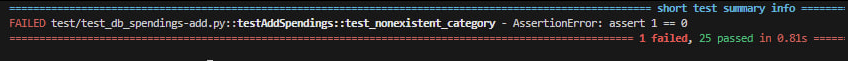
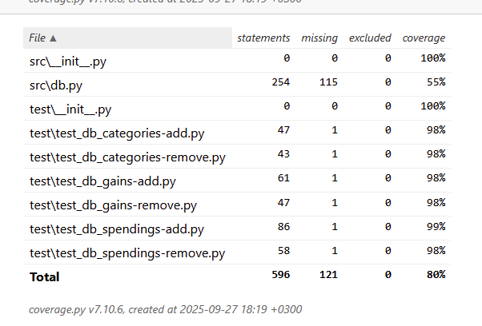
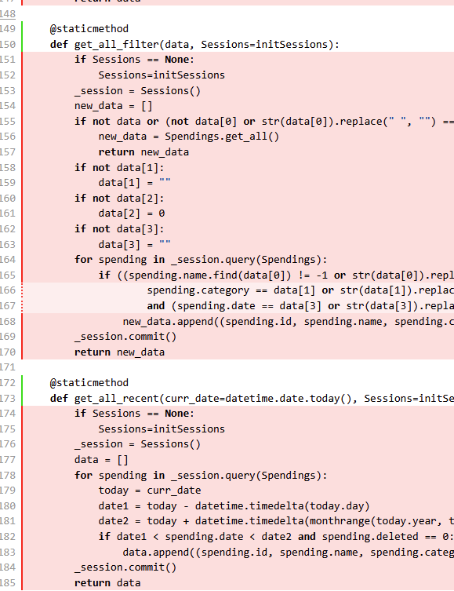
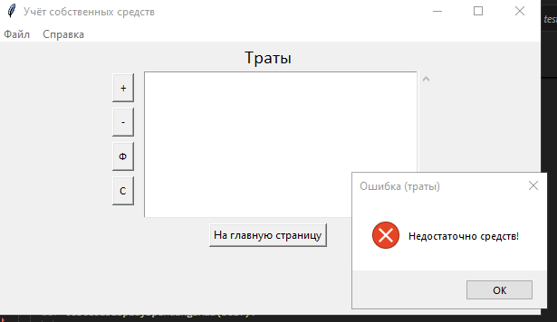
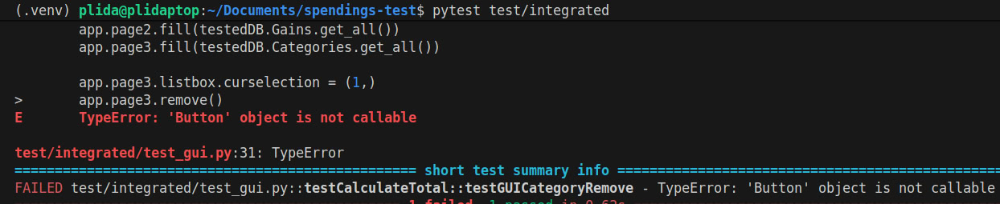
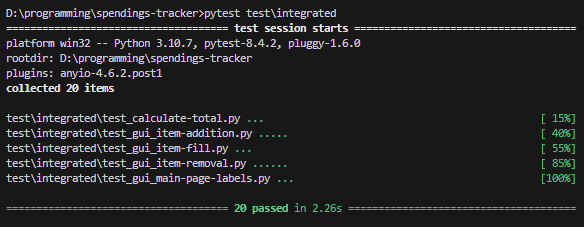

Автор: Крестьянова Елизавета Федоровна, K3323  
Телеграм: [https://t.me/plida27](https://t.me/plida27)  
Проект: [https://github.com/plida/spendings-tracker](https://github.com/plida/spendings-tracker)  
Форк проекта: [https://github.com/plida/testing_spendings-tracker/tree/main](https://github.com/plida/testing_spendings-tracker/tree/main)

# Лабораторная работа №1: Unit Testing

## Анализ функционала

Spendings Tracker – локальная программа для учёта собственных денежных средств.   
В ней представлен следующий функционал:

1. Добавления продукта в коллекцию.  
2. Просмотр все записи программы.  
3. Просмотр покупок по дате и категории.  
4. Сортировка покупок.  
5. Удаление требуемых записей.  
6. Выход из программы.

Программа написана на языке Python и состоит из 4-ёх файлов: 

1. Инициализатор main.py  
2. Функционал базы данных db.py  
3. Интерфейс (tkinter) gui.py  
4. Скрипт интерфейса gui_script.py

В инициализаторе нет функций, которые можно протестировать. 

Файл интерфейса крайне сложно юнит-тестировать из-за его сильной зависимости от tkinter и минимальной логики. В нём практически нет функций, которые бы что-то принимали и возвращали.

Основная логика интерфейса перемещена в свой скрипт, но он сам практически исключительно вызывает функции базы данных. Определённые функции подсчёта общей суммы покупок/трат могут быть протестированы, но они требуют значительной переписи. В них заложены вызовы к скрипту базы данных, которые полагаются на реальную базу данных.

Остаётся скрипт базы данных. Его наиболее важно проверять, так как важно сохранить целостность базы данных пользователя.

База данных состоит из следующих таблиц:

1. Категории.  
2. Покупки.  
3. Доходы.

К каждой таблице пользователь обращается, когда он добавляет запись, удаляет запись и выводит все записи, недавние записи, и записи по фильтру.  
Наибольший приоритет стоит у функционала удаления и добавления.

Наиболее сложны функции добавления. Стоят определённые требования, чтобы только корректные данные записывались в базу данных. Больше всего юнит тестов будет покрывать именно их.

## Написание тестов

Было написано 6 скриптов для всех 3 таблиц: проверка добавления и удаления. 

### Arrange

В каждом скрипте есть класс, в котором указываются все тесты, и функция SetUp, инициализирующую тестовую базу данных и чистящую её.
```
def initiateDB(self, path):  
    global engine  
    engine = db.create_engine("sqlite:///" + path, echo=True)  
    Base.metadata.create_all(engine)  
    self.Sessions = sessionmaker(bind=engine)

def setUp(self):  
    self.curr_date = datetime.date(2025, 9, 21)  
    self.initiateDB("test/test_spendings.db")  
    self.clearData(self.Sessions())

def clearData(self, session):  
    meta = Base.metadata  
    for table in reversed(meta.sorted_tables):  
        session.execute(table.delete())  
    session.commit()
```
В каждом скрипте теста вне класса указываются классы базы данных. Они прописываются для того, чтобы не обращаться лишний раз к скрипту базы данных. В классах таблиц указываются только столбцы для эффективности.
```
class Base(DeclarativeBase):  
    pass

class Categories(Base):  
    __tablename__ = 'categories'  
    name: Mapped[str] = db.Column(db.String(), primary_key=True)  
    deleted: Mapped[bool]
```
Обращаться лишний раз к базе данных не стоит, а проверять функционал как-то надо, поэтому в тестах прописываются функции, добавляющие записи в таблицы и выводящие их.  
Никакой проверки на верность введённых данных не проводится, чтобы не замедлять тесты.
```
def listItems(self):  
    _session = self.Sessions()  
    data = []  
    for category in _session.query(Categories).filter_by(deleted=False):  
        data.append((category.name))  
    _session.commit()  
    return data

def addItem(self, data):  
    _session = self.Sessions()  
    query = Categories(name=data, deleted=0)  
    _session.add(query)  
    _session.commit()
```
При инициализации каждого теста вызывается функция SetUp, а также вызываются функции, например, добавления записей, если тестируется их удаление.  
```
def test_removeGains(self):  
    self.addItem(["зарплата", 50000, self.curr_date])  
    self.addItem(["подарок", 5000, self.curr_date])  
    <act>  
    <assert>

def test_addSpending(self):  
    self.addCategory("одежда")  
    <act>  
    <assert>
```
### Act

После подготовки вызываются методы самой базы данных. Методы были переписаны, чтобы они могли принимать сессии тестовой базы данных.
```
def test_removeGains(self):  
    <arrange>  
    testedDB.Gains.remove(1, self.Sessions)  
    <assert>

def test_duplicate(self):  
    testedDB.Categories.add("одежда", self.Sessions)  
    testedDB.Categories.add("одежда", self.Sessions)  
    <assert>

def test_emptyname(self):  
    testedDB.Categories.add("   ", self.Sessions)  
    <assert>

def test_addSpending(self):  
    <arrange>  
    testedDB.Spendings.add(["куртка", "одежда", 50000, self.curr_date], self.curr_date, self.Sessions)  
    <assert>

def test_largesum(self):  
    testedDB.Gains.add(["зарплата", 10**20, self.curr_date], self.curr_date, self.Sessions)  
    <assert>
```

### Assert

Везде проверка теста осуществлялась через подсчёт всех записей в таблице. Если запись успешно должна добавиться, значит записей должно быть 1, а если функция не должна пропустить некорректные данные, то таблица должна остаться пустой. А в функциях удаления проверяется удаление правильной записи.
```
def test_removeGains(self):  
    self.addItem(["зарплата", 50000, self.curr_date])  
    self.addItem(["подарок", 5000, self.curr_date])  
    testedDB.Gains.remove(1, self.Sessions)  
    assert self.listItems()[0][1] == "подарок"

def test_duplicate(self):  
    testedDB.Categories.add("одежда", self.Sessions)  
    testedDB.Categories.add("одежда", self.Sessions)  
    assert len(self.listItems()) == 1

def test_emptyname(self):  
    testedDB.Categories.add("   ", self.Sessions)  
    assert len(self.listItems()) == 0

def test_addSpending(self):  
    self.addCategory("одежда")  
    testedDB.Spendings.add(["куртка", "одежда", 50000, self.curr_date], self.curr_date, self.Sessions)  
    assert len(self.listItems()) == 1

def test_largesum(self):  
    self.addCategory("одежда")  
    testedDB.Spendings.add(["куртка", "одежда", 10**20, self.curr_date], self.curr_date, self.Sessions)  
    assert len(self.listItems()) == 0
```
## Запуск тестов (ошибки)

Когда тесты писались и запускались, уже были найдены ошибки в коде.

### Допуск пробелов


```
def test_emptyname(self):  
    testedDB.Categories.add("   ", self.Sessions)  
    assert len(self.listItems()) == 0
```
Сначала был написан тест, добавляющий пустую категорию “”. Это программа успешно ловила. Стоило поменять тест на “    “, программа неуспешно добавляла эти ложные данные в базу данных.

Оказывается, во всей базе данных были проверки на пустую строку, но не на строку с пробелами. Везде было необходимо форматировать строку для проверки:  
   
```str(data[0]).replace(" ", "") == ""```

### Можно приписать покупку к несуществующей категории

 
```
def test_nonexistent_category(self):  
    testedDB.Spendings.add(["куртка", "еда", 50000, self.curr_date], self.curr_date, self.Sessions)  
    assert len(self.listItems()) == 0
```
Это интересный случай, показывающий, как имплементация базы данных может потенциально сломаться, если изменить интерфейс.

В программе не было проверок на добавление покупки с несуществующей категорией.

Почему?

Если запустить программу и попробовать добавить покупку, можно увидеть, что категории выбираются из готового актуального списка.  


То есть нет возможности добавить несуществующую категорию, поэтому проверка не была написана изначально.

Но прошедшее время позволило забыть об этой детале и написать тест, покрывающий это сценарий.

Это важно, т.к. интерфейс программы может поменяться. По какой-то причине выбор категорий может измениться на ввод категории вручную.

В итоге в программу была добавлена новая проверка:
```
if data[1] not in Categories.get_all(Sessions):  
      return "ERR_nocategory"```
```
## Запуск тестов (успех)

Так выглядит успешный запуск всех тестов.  


Также был подсчитан Code Coverage.  

Нас интересует файл db.py.

В нём покрыто только 55% утверждений, ведь не были написаны тесты для функций возврата записей.  
 
Ещё из интересного, в классах не тестировался результат EXIT:  
 
Он предназначен для специфичного случая, когда пользователь ничего не вводит в поля и нажимает на добавить. Окно интерфейса в таком случае просто закрывается.   
Это решено было не тестировать, т.к. уже были написаны тесты для случаев, когда хоть какое-то поле пустое. Задачей было протестировать взаимодействие с базой данных, а не с интерфейсом.

## Анализ тестирования

Были написаны тесты, покрывающие добавление и удаление записей базы данных. В общей сумме было написано 25 тестов, покрывающие 55% скрипта базы данных.   
Были найдены настоящие ошибки в имплементации с помощью тестирования. 

Проверим себя по принципу FIRST.

### Are the tests fast?

С уверенностью сложно заявить что-то о скорости тестов. Сейчас 25 тестов занимают 0.63 секунды. 

Каждый раз SetUp инициализирует базу данных, что может сказаться на времени. Вероятно, есть смысл вытащить инициализацию за класс теста, и один раз запустить её до тестов, но возникают проблемы зависимостей класса, которые пока не удалось решить.

### Are the tests isolated?

Да, тесты изолированы. 

1. Каждый раз при запуске теста таблицы чистятся.  
2. Используется тестовая база данных, не настоящая.  
3. Когда база данных проверяет текущее время для валидации дат, текущая дата подменяется фиксированным значением.  
4. Функции проверяемого скрипта базы данных вызываются единожды в стадии Act, они не вызываются для заполнения таблицы и вывода записей.

### Are the tests repeatable?

В тестах не используются никакие случайные значения, тесты не зависят от реального времени, поэтому результат никак не меняется, если не изменён сам тестируемый код.

### Are the tests self-validating?

Да, в каждом шаге Assert используется простая булевая проверка.

### Are the tests timely?

Из-за сути лабораторной работы, нет, тесты несвоевременны. Код был написан до работы, никакое тестирование не проводилось до начала проекта или во время работы над ним.

Однако пост-фактум тестирование позволило найти некоторые пропущенные ошибки и исправить их, так как они писались не по готовому интерфейсу программы (в результате чего все тесты проверяют только то, что уже успешно), а по изначальному заданию проекта.

# Лабораторная работа №2:  Integrated Testing

Для данной лабораторной работы был выбран проект Spendings Tracker.

## Анализ функционала

Spendings Tracker – локальная программа для учёта собственных денежных средств.   
В ней представлен следующий функционал:

1. Добавления продукта в коллекцию.  
2. Просмотр все записи программы.  
3. Просмотр покупок по дате и категории.  
4. Сортировка покупок.  
5. Удаление требуемых записей.  
6. Выход из программы.

Программа написана на языке Python и состоит из 4-ёх файлов: 

1. Инициализатор main.py  
2. Функционал базы данных db.py  
3. Интерфейс (tkinter) gui.py  
4. Скрипт интерфейса gui\_script.py

База данных состоит из следующих таблиц:

1. Категории.  
2. Покупки.  
3. Доходы.

К каждой таблице пользователь обращается, когда он добавляет запись, удаляет запись и выводит все записи, недавние записи, и записи по фильтру. Интерфейс состоит из главного экрана, где выводится текущий баланс, траты и доход за последний месяц. Из главного экрана можно перейти в окна категорий, покупок и доходов, где на каждой из них отображается список данных, а также кнопки, отвечающие за добавление, удаление, фильтрацию и сортировку.

Интеграционные тесты будут тестировать функции интерфейса, верное отображение информации в нём и корректность связи между интерфейсом и базой данных.  
Это оказалось нелёгкой задачей. Мануально тестировать интерфейс в какой-то степени легче, чем прописывать для этого автоматические тесты, из\-за следующих ограничений.

## Ограничения tkinter

Что оказалось невозможным автоматически проверить, так это ввод ошибочных данных. Tkinter очень сложно тестировать. При ошибочных данных он оставляет диалоговые окна открытыми. Например на скриншоте ниже можно увидеть, как неверные данные вызвали ошибку, эта ошибка высветилась диалоговым окном, и продолжила висеть.



Эти окна поставили тестирование на паузу, требуя ручной инпут от пользователя.

По похожей причине пришлось полностью избежать тестирования с диалоговыми окнами. В методах добавления было поставлено целью передавать данные диалоговому окну, куда обычно пользователь всё вписывает, но это оказалось очень сложным процессом. Если создать инстанс диалогового окна, он будет открыт и ждать ручного инпута, не было возможности успеть вставить значения поля и вызвать accept() у окна. Заранее тоже нельзя было как-то передать значения, в методе Add у страниц создаётся новый инстанс диалогового окна.

То есть, вручную тестируя, всё происходит идеально. Всё добавляется, диалоговые окна ошибок вызываются, всё хорошо. Но чтобы автоматически всё протестировать, было бы необходимо полностью переписать методы, и возникает вопрос, целесообразно ли таким заниматься, когда можно всё вручную протестировать?

Тем не менее, для второго тупика было решено добавить в функции добавления страниц передачу переменной специально для тестов. Если эта переменная передаётся, то диалог не вызывается, её прямо принимает скрипт интерфейса. 

Первый тупик технически решён первой лабораторной работой. Самое главное в этой программе \- запись верных данных в базу данных. У неё были прописаны многочисленные проверки данных. Также описанные ниже интеграционные тесты проверят частично работоспособность интерфейса. Не будут автоматически протестированы только сами диалоговые окна, которые можно протестировать вручную.

## Реструктуризация проекта

Работа велась над тем же проектом, что использовался для предыдущей работы, поэтому в папке остались юнит-тесты. Запускать их вместе с интеграционными тестами было бы тратой времени, поэтому было решено разделить тесты на 2 папки.

Из-за этого тесты потеряли доступ к файлам, которые они должны тестировать. Они не могли их найти. Поэтому тестируемое приложение было перенесено в папки src/app, где были созданы файлы init.py, чтобы pytest мог их найти. Таким образом, проект был упакован.

В файлах тестов были переписаны импорты. Теперь, беря модули из пакета, тестам нужно обращаться к src.app. Также запуск приложения из корневой папки осуществляется через “python \-m src.app.main”.

## Написание тестов

Тестов получилось 5:

1. testCalculateTotal \- проверка вычисления баланса в скрипте интерфейса. В нём три теста: вычисление полного баланса, трат в текущем месяце, доходов в текущем месяце. Это важная для пользователя информация, поэтому необходимо уследить, что скрипт правильно берёт информацию из базы данных и её вычисляет.  
2. testCheckLabel \- проверяет, что результаты, вычисление которых проверяет предыдущий тест, правильно вносятся в главную страницу интерфейса и отображаются. Наличие предыдущего теста необходимо для облегчения идентификации проблемной точки. Если провалены оба теста, что-то не так в скрипте. Если только в testCheckLabel, проблемы только с интерфейсом.  
3. testItemFill \- у страниц есть функция fill, заполняющая списки данными из базы. Очень важно, чтобы в списках была правильная информация, не только чтобы пользователь ее видел, но он также напрямую затем взаимодействует с позициями в списке, чтобы их удалить.  
4. testItemRemove \- проверка удаления позиций через интерфейс. Проверяется, что предмет был удалён из базы данных, и что на странице интерфейса новый список корректно отображается.  
5. testItemAddition \- проверка добавления позиций через интерфейс. Проверяется, что предмет был добавлен в базу данных и на страницу интерфейса.

### Arrange

В предыдущей лабораторной работе в каждом файле теста выделялись функции для подготовки: инициализация базы данных (SetUp()) и её чистка (clearData()), а также обозначение “текущей” даты. Изначально и в этой работе было решено так поступить, пока не была обнаружена проблема повтора создания и уничтожения приложения Tkinter.  
Для каждого теста, тестирующего интерфейс, должно создаваться приложение, быть произведены действия, а затем оно должно уничтожаться. Если создание приложения (root \= Tk(); app \= testedGUI.App(root)) ещё можно вывести в такую же функцию SetUp(), но что делать с root.destroy(), который неловко висит между Act и Assert?  
Оказывается, в Pytest можно указывать фикстуры. В них можно указать логику до начала теста, что тесту передаётся во время запуска, и логику после завершения теста.   
Таким образом для всех тестов было создано 3 фикстуры:

```
@pytest.fixture(autouse=True)
def initDB():
    testDB.initiate("test/integrated/spendings.db")
    clearData(testDB.initSessions())
    yield
    clearData(testDB.initSessions())

@pytest.fixture()
def curr_date():
    yield datetime.date(2025, 11, 26)

@pytest.fixture()
def app():
    root = Tk()
    app = testedGUI.App(root)
    yield app
    root.destroy()
```
initDB() \- инициализация базы данных. Никакие данные тестам не передаёт, поэтому у него прописан autouse=True – все интеграционные тесты с ним работают, его не приходится отдельно вызывать. В прошлой работе скрипт базы данных Mock-ался, здесь же нам это не требуется, работаем смело с самим файлом. При этом создаём тестовый файл, не работаем с реальной базой данных.  
Эта фикстура использует эту функцию по чистке БД из предыдущей работы:  
``` 
def clearData(session):  
    meta = testDB.Base.metadata  
    for table in reversed(meta.sorted\_tables):  
    session.execute(table.delete())  
    session.commit()  
```
curr\_date() – возвращает текущую дату.  
app() – создаёт приложение и уничтожает его после завершения теста. Тесту передаёт созданное приложение.

Создание новых тестов можно дальше оптимизировать, поместив все эти фикстуры в отдельный файл conftest.py.  


Он был помещён в ту же папку, что интеграционные тесты, и именно им загружаются эти фикстуры.   
При надобности, фикстуры можно менять в файлах тестов. Например, какая именно выставлена дата в curr\_date 3-ём тестам не важно, но 2-ум другим – test\_calculate-total и test\_gui\_main-page-labels – очень. В них тестируется вывод суммы доходов и трат за месяц. Было бы неудобно подводить все вводные данные теста к conftest.py, поэтому без проблем можно прописать эту фикстуру в скрипте с нужной датой.  
```
@pytest.fixture()  
def curr\_date():  
    yield datetime.date(2024, 11, 26)
```

Дальнейшие шаги подготовки зависят от целей теста. Во многих из них добавляются данные в базу данных.   
Если проверяется дисплей предметов в списке – из названий добавленных предметов убираются пробелы, т.к. в интерфейсе столбцы предметов разделены именно пробелами, и проще сравнивать дисплей с предметом разбив его на пробелы. Альтернативно в тесте можно задать ту отображаемую строку, которую мы ожидаем увидеть. Ещё альтернативнее можно не делать никаких проверок, а просто запомнить, что тесты не будут работать, если в названиях предметов есть пробелы. Но так будет некрасиво.  
Если в БД были добавлены предметы, и проверяется какая-то страничка интерфейса, она заполняется данными по команде fill() (Если это не тест по проверке fill(). Иначе это в раздел Act идёт). Наконец выполняется команда make\_page, говорящая интерфейсу переключиться на эту страницу.

В тестах добавления трат вызвало необходимость сначала обновлять totalVAR, т.к. траты не могут быть добавлены при нулевом балансе. При нормальном запуске приложения баланс заполняется при инициализации (в main.py). Это было перенесено в тест:  
```app.totalVAR.set(testedGUIscript.calculate\_total())```

### Act

Эту секцию обобщить не получится, пройдёмся по каждому тесту.

**testCalculateTotal:** вызов ```calculate\_total()```, ```calculate\_month\_gain(curr\_date)``` и ```calculate\_month\_spend(curr\_date)``` из gui\_script.py.

**testCheckLabel:** передача данных вызываемых выше функций в переменные приложения app.totalVAR, app.gainsVAR, app.spendingsVAR.

**testItemFill:** вызов ```page.fill(db.page.get\_all())``` соответствующей таблицы. 

**testItemRemove:** здесь интереснее:  
```
app.page3.listbox.selection\_set(1)  
app.page3.remove()  
```
Именно в listbox отображаются введённые данные. Через selection\_set можно выбрать позицию в списке, избежав необходимости выбрать его курсором. Затем вызывается функция удаления, которая подхватывает выбранную позицию через curselection().

**testItemAddition:** тот тест потребовал хлопот. Для всех 3-ёх страниц пришлось изменить методы Add. До написания тестов они просто вызывали диалоговое окно, ждали его закрытия и брали из него параметр .result. Как было описано выше, в данной работе не удалось произвести автоматических действий над диалоговыми окнами. Поэтому в Add приходится передавать данные напрямую:  
```
def add(self, data=[]):  
    if (data):  
        # for integration testing  
        result = gui_script.add_spending(data, self.app.totalVAR)  
    else:  
        var_spending = self._dialogue(self.master)  
        result = gui_script.add_spending(var_spending.result, self.app.totalVAR)
```

Затем данные прямолинейно добавляются, вызывая этот метод.   
```app.page1.add(itemToAdd)```

### Assert

**testCalculateTotal:** подсчитывается ожидаемый результат и сравнивается с реальными результатами вызываемых методов.

**testCheckLabel:** данный тест тоже потребовал небольших изменений программы. Ранее надписи на главной странице не были присвоены переменной. Этому тесту необходимо хватать данные этих надписей, поэтому было решено переменные присвоить: total\_label, gain\_label, spend\_label.  
Пример сбора данных с надписей (необходимо сначала взять переменную “textvariable”, а затем найти её значение):  
```
label_var = app.total_label.cget("textvariable")  
label_text = app.total_label.getvar(label_var)
```

Это найденное значение сравнивается с ожидаемым.

**testItemFill:** берётся листбокс страницы, конвертируется в список, хватается первый (и единственный) элемент, разделяется по пробелам, дата переводится в формат БД, и создаётся новый список. Таким образом можно проверить, что имя, цена, категория и дата по отдельности правильно разделены.
```
guiDisplay = list(app.page2.listbox.get(0, END))  
id, name, price, date = guiDisplay[0].split(' ')  
date = datetime.datetime.strptime(date, "%d/%m/%Y").date()  
listedItem = [name, float(price), date]
```
Готовый айтем сравнивается с тем списком, что был скормлен базе данных.

**testItemRemove:** в тестах связи с БД проверяется, что количество позиций соответствует ожидаемому, и что удалённой позиции точно в БД нет. В тестах дисплея хватается список, как и в предыдущем тесте:  
```
items = []  
for x in guiDisplay:  
    id, name, price, date = x.split(' ')  
    date = datetime.datetime.strptime(date, "%d/%m/%Y").date()  
    listedItem = [name, float(price), date]  
    items.append(listedItem)
```

И проверяется, что в дисплее отображается только те предметы, что не были удалены (здесь был удалён itemToAdd2):  
```items == [itemToAdd1, itemToAdd3]```

**testItemAddition:** аналогичен предыдущему тесту. Проверяется, что в БД и в дисплей позиция добавлена.

## Запуск тестов (ошибки)

### Переназначение функций SecPage

В классе SecPage указаны функции добавления, удаления, фильтрации и сортировки. В оригинальном коде их вызывали кнопки. Например кнопка self.remove вызывала функцию self.remove…



Попытка обратиться к функции удаления не приводила к успеху, т.к тест обращался к кнопке, занявшей это имя. На удивление, это до написания автоматических тестов не было замечено. Вероятно, когда кнопка создавалась, она успешно записывала указатель на функцию в command, и только потом она присваивалась переменной add.   

 

Тем не менее, переменные кнопок были переписаны.

## Запуск тестов (успех)

Так выглядит успешный запуск всех интеграционных тестов.  

  

Ввиду своей сложности они ощутимо занимают больше времени, чем юнит-тесты (2.26с на 20 тестов vs 0.62с на 25 тестов).

## Анализ тестирования

В ходе работы были написаны 5 интеграционных тестов (а если быть точнее, то 20), покрывающих самые важные части интерфейса: отображение баланса, добавление, удаление и отображение предметов.  

В работе возникли сложности тестирования tkinter, и не со всеми ними удалось совладать. Диалоговые окна совсем не были проверены, из\-за чего интерфейс покрыт только на 57% (если судить по code coverage). Проверка окон ошибки при вводе неверных данных также не была совершена. Либо необходимо находить способы совладания с tkinter, в процессе рискуя переписать полностью логику диалоговых окон, либо это остаётся на ручном тестировании. 

В целом, результат лабораторной работы положителен. Тестами успешно проверяются самые важные связи между интерфейсом и базой данных, а также в процессе работы были получены полезные знания по работе с tkinter, определению фикстур для унификации тестов и структуризации проектов в python.

