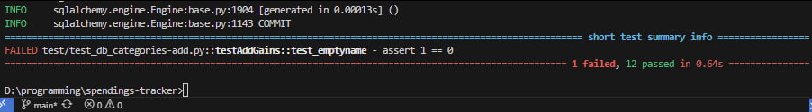
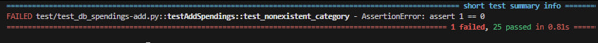
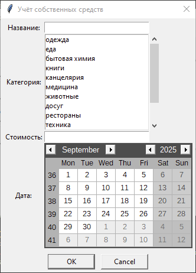
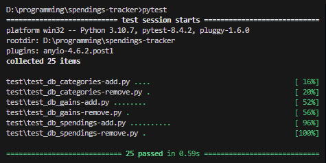
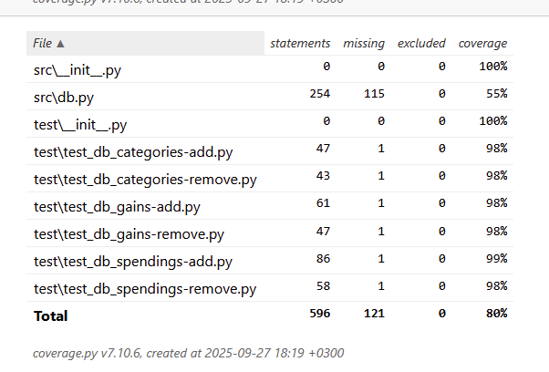
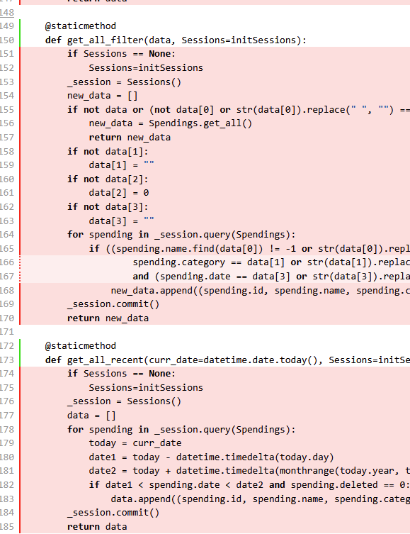
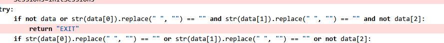

Автор: Крестьянова Елизавета Федоровна, K3323  
Телеграм: [https://t.me/plida27](https://t.me/plida27)  
Проект: [https://github.com/plida/spendings-tracker](https://github.com/plida/spendings-tracker)  
Форк проекта: [https://github.com/plida/testing_spendings-tracker/tree/main](https://github.com/plida/testing_spendings-tracker/tree/main)

# Лабораторная работа №1: Unit Testing

## Анализ функционала

Spendings Tracker – локальная программа для учёта собственных денежных средств.   
В ней представлен следующий функционал:

1. Добавления продукта в коллекцию.  
2. Просмотр все записи программы.  
3. Просмотр покупок по дате и категории.  
4. Сортировка покупок.  
5. Удаление требуемых записей.  
6. Выход из программы.

Программа написана на языке Python и состоит из 4-ёх файлов: 

1. Инициализатор main.py  
2. Функционал базы данных db.py  
3. Интерфейс (tkinter) gui.py  
4. Скрипт интерфейса gui_script.py

В инициализаторе нет функций, которые можно протестировать. 

Файл интерфейса крайне сложно юнит-тестировать из-за его сильной зависимости от tkinter и минимальной логики. В нём практически нет функций, которые бы что-то принимали и возвращали.

Основная логика интерфейса перемещена в свой скрипт, но он сам практически исключительно вызывает функции базы данных. Определённые функции подсчёта общей суммы покупок/трат могут быть протестированы, но они требуют значительной переписи. В них заложены вызовы к скрипту базы данных, которые полагаются на реальную базу данных.

Остаётся скрипт базы данных. Его наиболее важно проверять, так как важно сохранить целостность базы данных пользователя.

База данных состоит из следующих таблиц:

1. Категории.  
2. Покупки.  
3. Доходы.

К каждой таблице пользователь обращается, когда он добавляет запись, удаляет запись и выводит все записи, недавние записи, и записи по фильтру.  
Наибольший приоритет стоит у функционала удаления и добавления.

Наиболее сложны функции добавления. Стоят определённые требования, чтобы только корректные данные записывались в базу данных. Больше всего юнит тестов будет покрывать именно их.

## Написание тестов

Было написано 6 скриптов для всех 3 таблиц: проверка добавления и удаления. 

### Arrange

В каждом скрипте есть класс, в котором указываются все тесты, и функция SetUp, инициализирующую тестовую базу данных и чистящую её.
```
def initiateDB(self, path):  
    global engine  
    engine = db.create_engine("sqlite:///" + path, echo=True)  
    Base.metadata.create_all(engine)  
    self.Sessions = sessionmaker(bind=engine)

def setUp(self):  
    self.curr_date = datetime.date(2025, 9, 21)  
    self.initiateDB("test/test_spendings.db")  
    self.clearData(self.Sessions())

def clearData(self, session):  
    meta = Base.metadata  
    for table in reversed(meta.sorted_tables):  
        session.execute(table.delete())  
    session.commit()
```
В каждом скрипте теста вне класса указываются классы базы данных. Они прописываются для того, чтобы не обращаться лишний раз к скрипту базы данных. В классах таблиц указываются только столбцы для эффективности.
```
class Base(DeclarativeBase):  
    pass

class Categories(Base):  
    __tablename__ = 'categories'  
    name: Mapped[str] = db.Column(db.String(), primary_key=True)  
    deleted: Mapped[bool]
```
Обращаться лишний раз к базе данных не стоит, а проверять функционал как-то надо, поэтому в тестах прописываются функции, добавляющие записи в таблицы и выводящие их.  
Никакой проверки на верность введённых данных не проводится, чтобы не замедлять тесты.
```
def listItems(self):  
    _session = self.Sessions()  
    data = []  
    for category in _session.query(Categories).filter_by(deleted=False):  
        data.append((category.name))  
    _session.commit()  
    return data

def addItem(self, data):  
    _session = self.Sessions()  
    query = Categories(name=data, deleted=0)  
    _session.add(query)  
    _session.commit()
```
При инициализации каждого теста вызывается функция SetUp, а также вызываются функции, например, добавления записей, если тестируется их удаление.  
```
def test_removeGains(self):  
    self.addItem(["зарплата", 50000, self.curr_date])  
    self.addItem(["подарок", 5000, self.curr_date])  
    <act>  
    <assert>

def test_addSpending(self):  
    self.addCategory("одежда")  
    <act>  
    <assert>
```
### Act

После подготовки вызываются методы самой базы данных. Методы были переписаны, чтобы они могли принимать сессии тестовой базы данных.
```
def test_removeGains(self):  
    <arrange>  
    testedDB.Gains.remove(1, self.Sessions)  
    <assert>

def test_duplicate(self):  
    testedDB.Categories.add("одежда", self.Sessions)  
    testedDB.Categories.add("одежда", self.Sessions)  
    <assert>

def test_emptyname(self):  
    testedDB.Categories.add("   ", self.Sessions)  
    <assert>

def test_addSpending(self):  
    <arrange>  
    testedDB.Spendings.add(["куртка", "одежда", 50000, self.curr_date], self.curr_date, self.Sessions)  
    <assert>

def test_largesum(self):  
    testedDB.Gains.add(["зарплата", 10**20, self.curr_date], self.curr_date, self.Sessions)  
    <assert>
```

### Assert

Везде проверка теста осуществлялась через подсчёт всех записей в таблице. Если запись успешно должна добавиться, значит записей должно быть 1, а если функция не должна пропустить некорректные данные, то таблица должна остаться пустой. А в функциях удаления проверяется удаление правильной записи.
```
def test_removeGains(self):  
    self.addItem(["зарплата", 50000, self.curr_date])  
    self.addItem(["подарок", 5000, self.curr_date])  
    testedDB.Gains.remove(1, self.Sessions)  
    assert self.listItems()[0][1] == "подарок"

def test_duplicate(self):  
    testedDB.Categories.add("одежда", self.Sessions)  
    testedDB.Categories.add("одежда", self.Sessions)  
    assert len(self.listItems()) == 1

def test_emptyname(self):  
    testedDB.Categories.add("   ", self.Sessions)  
    assert len(self.listItems()) == 0

def test_addSpending(self):  
    self.addCategory("одежда")  
    testedDB.Spendings.add(["куртка", "одежда", 50000, self.curr_date], self.curr_date, self.Sessions)  
    assert len(self.listItems()) == 1

def test_largesum(self):  
    self.addCategory("одежда")  
    testedDB.Spendings.add(["куртка", "одежда", 10**20, self.curr_date], self.curr_date, self.Sessions)  
    assert len(self.listItems()) == 0
```
## Запуск тестов (ошибки)

Когда тесты писались и запускались, уже были найдены ошибки в коде.

### Допуск пробелов


```
def test_emptyname(self):  
    testedDB.Categories.add("   ", self.Sessions)  
    assert len(self.listItems()) == 0
```
Сначала был написан тест, добавляющий пустую категорию “”. Это программа успешно ловила. Стоило поменять тест на “    “, программа неуспешно добавляла эти ложные данные в базу данных.

Оказывается, во всей базе данных были проверки на пустую строку, но не на строку с пробелами. Везде было необходимо форматировать строку для проверки:  
   
```str(data[0]).replace(" ", "") == ""```

### Можно приписать покупку к несуществующей категории

 
```
def test_nonexistent_category(self):  
    testedDB.Spendings.add(["куртка", "еда", 50000, self.curr_date], self.curr_date, self.Sessions)  
    assert len(self.listItems()) == 0
```
Это интересный случай, показывающий, как имплементация базы данных может потенциально сломаться, если изменить интерфейс.

В программе не было проверок на добавление покупки с несуществующей категорией.

Почему?

Если запустить программу и попробовать добавить покупку, можно увидеть, что категории выбираются из готового актуального списка.  


То есть нет возможности добавить несуществующую категорию, поэтому проверка не была написана изначально.

Но прошедшее время позволило забыть об этой детале и написать тест, покрывающий это сценарий.

Это важно, т.к. интерфейс программы может поменяться. По какой-то причине выбор категорий может измениться на ввод категории вручную.

В итоге в программу была добавлена новая проверка:
```
if data[1] not in Categories.get_all(Sessions):  
      return "ERR_nocategory"```
```
## Запуск тестов (успех)

Так выглядит успешный запуск всех тестов.  


Также был подсчитан Code Coverage.  

Нас интересует файл db.py.

В нём покрыто только 55% утверждений, ведь не были написаны тесты для функций возврата записей.  
 
Ещё из интересного, в классах не тестировался результат EXIT:  
 
Он предназначен для специфичного случая, когда пользователь ничего не вводит в поля и нажимает на добавить. Окно интерфейса в таком случае просто закрывается.   
Это решено было не тестировать, т.к. уже были написаны тесты для случаев, когда хоть какое-то поле пустое. Задачей было протестировать взаимодействие с базой данных, а не с интерфейсом.

## Анализ тестирования

Были написаны тесты, покрывающие добавление и удаление записей базы данных. В общей сумме было написано 25 тестов, покрывающие 55% скрипта базы данных.   
Были найдены настоящие ошибки в имплементации с помощью тестирования. 

Проверим себя по принципу FIRST.

### Are the tests fast?

С уверенностью сложно заявить что-то о скорости тестов. Сейчас 25 тестов занимают 0.63 секунды. 

Каждый раз SetUp инициализирует базу данных, что может сказаться на времени. Вероятно, есть смысл вытащить инициализацию за класс теста, и один раз запустить её до тестов, но возникают проблемы зависимостей класса, которые пока не удалось решить.

### Are the tests isolated?

Да, тесты изолированы. 

1. Каждый раз при запуске теста таблицы чистятся.  
2. Используется тестовая база данных, не настоящая.  
3. Когда база данных проверяет текущее время для валидации дат, текущая дата подменяется фиксированным значением.  
4. Функции проверяемого скрипта базы данных вызываются единожды в стадии Act, они не вызываются для заполнения таблицы и вывода записей.

### Are the tests repeatable?

В тестах не используются никакие случайные значения, тесты не зависят от реального времени, поэтому результат никак не меняется, если не изменён сам тестируемый код.

### Are the tests self-validating?

Да, в каждом шаге Assert используется простая булевая проверка.

### Are the tests timely?

Из-за сути лабораторной работы, нет, тесты несвоевременны. Код был написан до работы, никакое тестирование не проводилось до начала проекта или во время работы над ним.

Однако пост-фактум тестирование позволило найти некоторые пропущенные ошибки и исправить их, так как они писались не по готовому интерфейсу программы (в результате чего все тесты проверяют только то, что уже успешно), а по изначальному заданию проекта.
